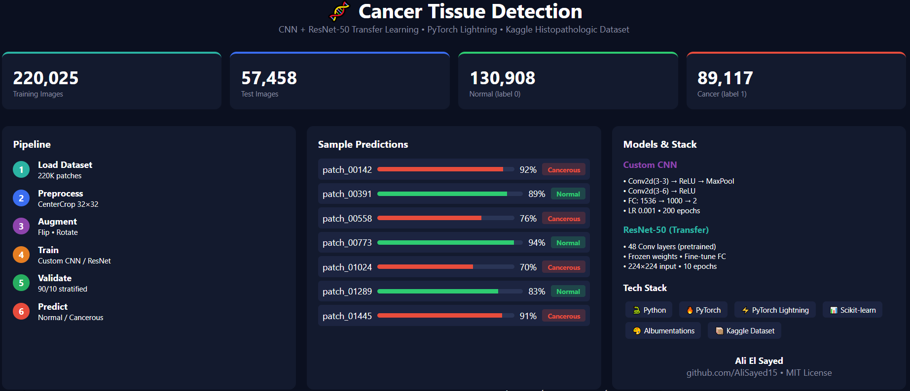
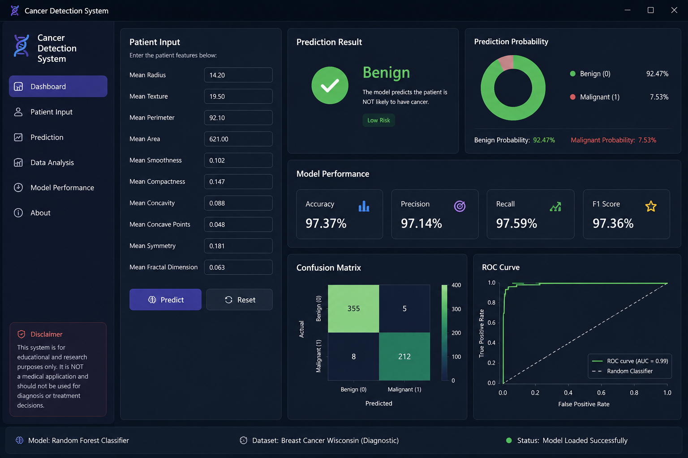
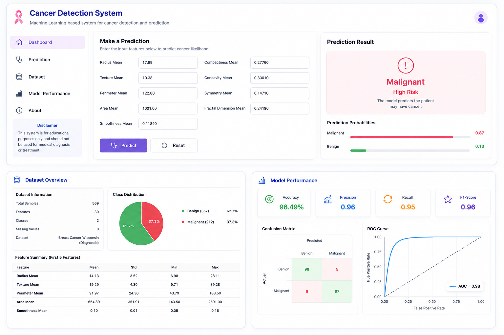

🧬 Cancer Detection System

A machine learning-based application designed to assist in detecting cancer-related patterns using data analysis and predictive modeling.

📌 Overview

The Cancer Detection System is a data-driven project that aims to analyze medical data and predict potential cancer cases using machine learning techniques.

This project demonstrates your ability to work with:

🤖 Machine Learning models

📊 Data preprocessing & analysis

🧠 Predictive modeling

🧬 Health-related datasets

Machine learning is increasingly used in cancer detection to assist doctors by identifying patterns in medical data and improving early diagnosis accuracy.

## 🖼️ System Visualization

*The above diagram illustrates the machine learning model architecture used for cancer detection.*

*This image shows the system interface and workflow.*

*Sample output generated by the model after processing input data.*

⚠️ Important Disclaimer

This project is for educational and research purposes only.

It is NOT a medical application and should not be used for diagnosis or treatment decisions.

✨ Features

📊 Analyze medical or dataset inputs

🤖 Predict cancer likelihood using ML model

⚡ Fast and automated predictions

🧠 Demonstrates ML workflow (training → testing → prediction)

🛠️ Tech Stack

Python

Machine Learning (e.g., Scikit-learn / TensorFlow / etc.)

Jupyter Notebook / Scripts

📂 Project Structure

.
├── data/            # Dataset files
├── models/          # Trained models (if any)
├── notebooks/       # Jupyter notebooks
├── src/             # Core logic
└── main.py          # Entry point

🚀 Getting Started

Prerequisites

Python 3.x

Required libraries (install via requirements.txt if available)

Installation

git clone https://github.com/AliSayed15/cancer-detection.git

cd cancer-detection

pip install -r requirements.txt

python main.py

🎯 How It Works

Dataset is loaded and preprocessed

Features are extracted and cleaned

Machine learning model is trained

Model is evaluated on test data

Predictions are generated based on input

📈 Future Improvements

Improve model accuracy 📊

Use deep learning (CNN) for image-based detection 🧠

Add web interface (Flask / Django) 🌐

Integrate real datasets (medical imaging) 🧬

Deploy as a web app 🚀

👨‍💻 Author

Ali El Sayed

🔗 LinkedIn: https://www.linkedin.com/in/ali-elsayed-1a51a7216/

💻 GitHub: https://github.com/AliSayed15

🤝 Contributing

Contributions are welcome!

Feel free to fork the repository and submit a pull request.

📄 License

This project is open-source and available under the MIT License.
